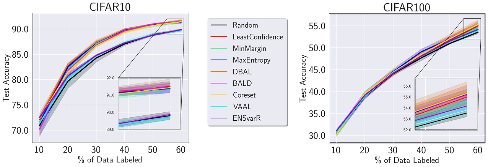

# Deep Active Learning Toolkit for Image Classification in PyTorch

This is a code base for deep active learning for image classification written in [PyTorch](https://pytorch.org/). It is build on top of FAIR's [pycls](https://github.com/facebookresearch/pycls/). I want to emphasize that this is a derivative of the toolkit originally shared with me via email by Prateek Munjal _et al._, the authors of the paper _"Towards Robust and Reproducible Active Learning using Neural Networks"_, paper available [here](https://arxiv.org/abs/2002.09564).  

## Introduction

The goal of this repository is to provide a simple and flexible codebase for deep active learning. It is designed to support rapid implementation and evaluation of research ideas. We also provide a results on CIFAR10 below.

The codebase currently only supports single-machine single-gpu training. We will soon scale it to single-machine multi-gpu training, powered by the PyTorch distributed package.

## Using the Toolkit

Please see [`GETTING_STARTED`](docs/GETTING_STARTED.md) for brief instructions on installation, adding new datasets, basic usage examples, etc.

## Active Learning Methods Supported
* Uncertainty Sampling
  * Least Confidence
  * Min-Margin
  * Max-Entropy
  * Deep Bayesian Active Learning (DBAL) [1]
  * Bayesian Active Learning by Disagreement (BALD) [1]
* Diversity Sampling 
  * Coreset (greedy) [2]
  * Variational Adversarial Active Learning (VAAL) [3]
* Query-by-Committee Sampling
  * Ensemble Variation Ratio (Ens-varR) [4]


## Datasets Supported
* [CIFAR10/100](https://www.cs.toronto.edu/~kriz/cifar.html)
* [MNIST](http://yann.lecun.com/exdb/mnist/)
* [SVHN](http://ufldl.stanford.edu/housenumbers/)
* [Tiny ImageNet](https://www.kaggle.com/c/tiny-imagenet) (Download the zip file [here](http://cs231n.stanford.edu/tiny-imagenet-200.zip))
* Long-Tail CIFAR-10/100

Follow the instructions in [`GETTING_STARTED`](docs/GETTING_STARTED.md) to add a new dataset. 

## Results on CIFAR10 and CIFAR100 

The following are the results on CIFAR10 and CIFAR100, trained with hyperameters present in `configs/cifar10/al/RESNET18.yaml` and `configs/cifar100/al/RESNET18.yaml` respectively. All results were averaged over 3 runs. 

<!--  -->

<div align="center">

</div>

###  CIFAR10 at 60%
```
|    AL Method     |        Test Accuracy        |
|:----------------:|:---------------------------:|
|            DBAL  |       91.670000 +- 0.230651 |
| Least Confidence |       91.510000 +- 0.087178 |
|            BALD  |       91.470000 +- 0.293087 |
|         Coreset  |       91.433333 +- 0.090738 |
|     Max-Entropy  |       91.373333 +- 0.363639 |
|      Min-Margin  |       91.333333 +- 0.234592 |
|   Ensemble-varR  |       89.866667 +- 0.127410 |
|          Random  |       89.803333 +- 0.230290 |
|            VAAL  |       89.690000 +- 0.115326 |
```

### CIFAR100 at 60%
```
|    AL Method     |        Test Accuracy        |
|:----------------:|:---------------------------:|
|            DBAL  |       55.400000 +- 1.037931 |
|         Coreset  |       55.333333 +- 0.773714 |
|     Max-Entropy  |       55.226667 +- 0.536128 |
|            BALD  |       55.186667 +- 0.369639 |
| Least Confidence |       55.003333 +- 0.937248 |
|      Min-Margin  |       54.543333 +- 0.611583 |
|   Ensemble-varR  |       54.186667 +- 0.325628 |
|            VAAL  |       53.943333 +- 0.680686 |
|          Random  |       53.546667 +- 0.302875 |
```

## Citing this Repository

If you find this repo helpful in your research, please consider citing us and the owners of the original toolkit:

```
@article{Chandra2021DeepAL,
    Author = {Akshay L Chandra and Vineeth N Balasubramanian},
    Title = {Deep Active Learning Toolkit for Image Classification in PyTorch},
    Journal = {https://github.com/acl21/deep-active-learning-pytorch},
    Year = {2021}
}

@article{Munjal2020TowardsRA,
  title={Towards Robust and Reproducible Active Learning Using Neural Networks},
  author={Prateek Munjal and N. Hayat and Munawar Hayat and J. Sourati and S. Khan},
  journal={ArXiv},
  year={2020},
  volume={abs/2002.09564}
}
```

## License

This toolkit is released under the MIT license. Please see the [LICENSE](LICENSE) file for more information.

## References

[1] Yarin Gal, Riashat Islam, and Zoubin Ghahramani. Deep bayesian active learning with image data. In Proceedings of the 34th International Conference on Machine Learning-Volume 70, pages 1183–1192. JMLR. org, 2017.

[2] Ozan Sener and Silvio Savarese. Active learning for convolutional neural networks: A core-set approach. In International Conference on Learning Representations, 2018.

[3] Sinha, Samarth et al. Variational Adversarial Active Learning. 2019 IEEE/CVF International Conference on Computer Vision (ICCV) (2019): 5971-5980.

[4] William H. Beluch, Tim Genewein, Andreas Nürnberger, and Jan M. Köhler. The power of ensembles for active learning in image classification. 2018 IEEE/CVF Conference on Computer Vision and Pattern Recognition, pages 9368–9377, 2018.